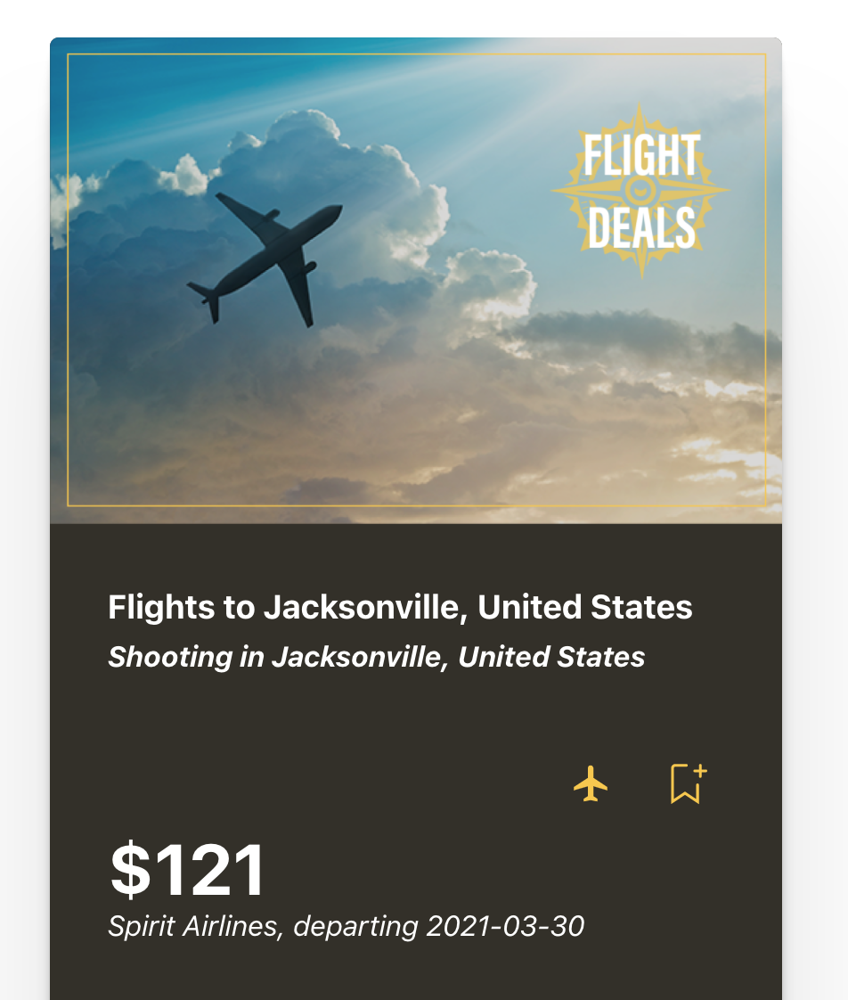

https://thriftiest-traveler-client.vercel.app/

# Thriftiest-Traveler

Thriftiest-Traveler shows you the best deals on travel in areas that have recently experienced a disaster or terrorist-related events.
If you're looking to save some money on seeing some amazing places this may be the app for you!
The user's default location will be determined via their IP address.
Their city airport will then be determined via their IP address and used to find flight prices to event locations.
There is a threshold of 50 API calls a minute. Depending on the refresh of the deals tab it may return no deals. You may reload after one minute.
The default call to the API is 20 on loading the Deals tab. Results include Price, Location, Departure Date, Description of event, and title.
Users can save a flight deal as well as a flight icon that will navigate them to Orbitz.com where they can search
for their deal for direct access to purchasing tickets. Deal information is not automatically populated in the Orbitz search. Next to the flight icon,
there is also a save/bookmark icon where users can save the flight information. When saved these fights will appear in your saved tab when logged in.
To delete the saved flight you'll need to find the flight in the saved tab and click the delete bookmark icon.

## Motivation
I created this app after seeing a TikTok video of a traveler utilizing this method for saving money when booking trips.
I thought it was a unique way to approach travel to experience incredible cities and countries at the lowest possible
prices.

## Screenshots
Landing Page:

Deals:

## How to Use

1. Register an account or login using your own credentials or that of the Demo account.
2. Once the user is logged in they will be automatically re-directed to the Deals tab.
3. Scroll through the Deals and save ones that look appealing. Navigate to Orbitz using the plane icon to book your trip today!

## Built With

### Front-End
* React
* JSX
* JavaScript
* jQuery
* Jest
* Axios
* Service Objects
* Routing
* Error Boundaries
* JWT
* Hooks
* CSS

## Features

* Secure login and registration technology.
* Loads the most current flight prices to cities that have had tourist draining events.
* Dynamically displayed results
* Dynamically Save and Delete flight deals to your account.
* Direct access to Orbitz.com

## Authors

* **Topher Dunlap** - ** - Design, Front-End development/testing, styling, deployment and iteration.

